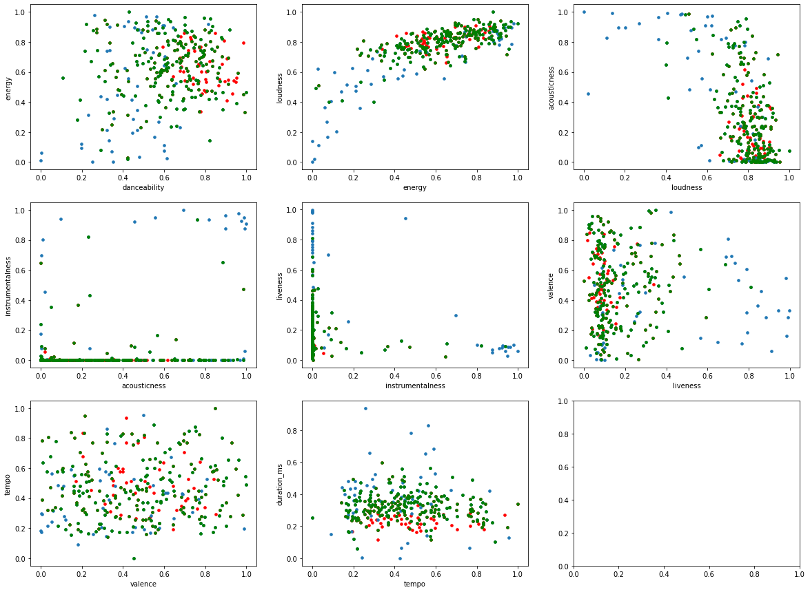

# Will It Go Viral?: Predicting Song Virality on TikTok based on Audio and Popularity Features
## Summary Figure 

## Introduction/Background
- Songs with specific danceability, energy, valence etc. that fit with the nature of short videos are preferred to be used by popular TikTok users. Artists’ and albums’ popularity may also affect how frequently a song is chosen. 
- Although there are some past researches on how certain features may help with making a viral song, their results show poor accuracy when being directly implemented to TikTok. As TikTok becomes the best place to promote songs, we aim to develop a new comprehensive approach on predicting viral songs specifically for TikTok users.
- In our project, we will analyze the underlying features for the songs that are frequently used by TikTok users, and then predict whether they will go viral.

## Methods
  As stated above, our approach is new in building analysis on only the songs that went viral in TikTok by web-scraping TokBoard and accessing Spotify API.
- **Datasets**
  - Datapoints
    - 128 viral TikTok tracks from “Best TikTok Songs 2019-2022” Spotify playlist
    - TokBoard 2019-2022 monthly favorites
    - 500 randomly sampled Spotify track
    - Total of 1000 datapoints (500 viral, 500 non-viral, no duplicates allowed)
  - Features [2]
    - Acousticness, Danceability, Energy,  Instrumentalness, Speechiness (float, [0,1])
    - Duration (integer, in milliseconds)
    - Loudness (float, in decibels, generally [-60,0])
    - Tempo (float, in beats per minute)
    - Valence (float, [0,1], measures mood of music)
    - Popularity of artist on Spotify, Popularity of track on Spotify (integer, [0,100])
  - Target
    - Predicting between two discrete categories: “non-viral” (0) and “viral” (1) (boolean, 0/1).
- **Approaches**
  - Data Cleaning and Standardization
    - Normalize features so that they are with the same range
  - Feature Engineering [3]
    - Correlation Heatmap and mutual information analysis to eliminate redundant features
    - P-value: Remove a feature and measure p-value in each case. Decide whether to keep the feature.
  - Dimension Reduction
    - Principal Component Analysis (unsupervised): Summarizes information from large amount of features into a smaller set of summary indices
  - Unsupervised [4]
    - Goal is to form clusters of viral tracks using combinations of the features we choose after feature engineering and dimension reduction
    - K-means: Initializer to Gaussian Mixture Model
    - Gaussian Mixture Model: Gives probability that a  given data point belongs to a specific cluster
  - Supervised
    - Dataset would be split into testing and training data.
    - Two-Class Support Vector Machine [5]: Finds hyperplane that best separates the two classes (“viral” and “non-viral” from our labeled dataset)
      - Try logistic regression to see how it performs
    - Two-Class Boosted Decision Tree [1]: Subsequent decision trees correct for errors in the previous decision trees.
    - 
  - Cost & Limitations:
    - It takes more time to scrape the TokBoard page and Spotify API to get all the information than having existing datasets. 
    - Influencer posts, dance challenges, amount of related hashtags may also influence the popularity of tracks. It is complex to measure the true reason behind a track’s virality, the credibility of picked datapoints might be down a bit.
    - Our model isn't performing real-time detection but only takes previous data.

 
## Results
- **Unsupervised**
  - Feature reduction: 1. visible correlation between fields such as acousticness and instrumentalness allowing sizing down of features. 2. Little or no mutual information between some features and virality.
  - K-means and GMM: We expect k-means to give clusters of viral tracks that have similar features within a cluster and different features between clusters. GMM should give probability that a track belongs to a certain cluster.
  - **_Midterm_:** team has decided on a set of features to train supervised models with found clusters
- **Supervised**
  - “Viral”/ “Non-viral” labels outputted by SVM and decision tree will be evaluated with confusion matrices, including accuracy.
  - **_Final_:** team has built supervised algorithms and achieved above 70% accuracy in predicting track virality

## Discussion
- If the model performs well, it would mean that whether a TikTok track goes viral mainly depends on the audio features of the track, and TikTok users do have a preference of certain types of tracks as background music than others
- This research could be used by advertisers and influencers on TikTok when picking music to go with their videos. It could also be used by music artists to make tracks that are likely to be shared on TikTok. 
- Future Work: Evaluate why certain songs that we considered “non-viral” becomes trendy, and take those features as new rubrics to build a more complete model

## References
1. https://royalsocietypublishing.org/doi/10.1098/rsos.171274
2. https://medium.com/the-dopamine-effect/how-to-make-a-viral-tiktok-song-ece56a838a30
3. https://developer.spotify.com/documentation/web-api/reference/#/operations/get-several-audio-features (Spotify API documentation)
4. https://vishalramesh.substack.com/p/feature-selection-correlation-and-p-value-da8921bfb3cf?s=w (Published on Towards Data Science)
5. https://towardsdatascience.com/gaussian-mixture-models-vs-k-means-which-one-to-choose-62f2736025f0
6. https://www.analyticsvidhya.com/blog/2021/10/support-vector-machinessvm-a-complete-guide-for-beginners/

# Final Report: Unsupervised Methods 
## Methodology
### Dataset:
  - Retrieved audio features of 200 viral TikTok songs by querying the Spotify API.
    -  Audio features: danceability, energy, loudness, acousticness, instrumentalness, liveness, valence, tempo, duration (numerical)
    -  Found the largest Spotify playlist with the most likes for viral TikTok songs in 2022. Using Spotipy, a Python library for the Spotify Web API, retrieved audio features for all songs in the playlist.
  -  Acquired online dataset of ~200,000 random non-viral songs and corresponding audio features.
      - Initially tried to use a Spotipy package to retrieve randomly sampled songs. However, this process retrieved many popular songs (not a completely random process).
      - *Chose a randomly selected subset of 200 non-viral songs from this list in order to make sure that our dataset is balanced for clustering*
  - New target feature added to dataset: 0 if not viral, 1 if viral. Discrete classification problem.
  - Challenge: choosing an appropriate number of random non-viral songs to use with our viral song dataset.
    - The team has conducted all analysis with the full dataset and the randomly selected 200 songs. However, we are looking for guidance on whether it is right to decrease the number of non-viral songs used in the analysis and how to do that effectively.
### Procedure:
   - **Data Cleaning and Standardization**
      - Normalized all features to be on 0-1 scale.
      - Removed duplicates between non-viral and viral song lists (final dataset of 200 viral songs and 198 non-viral songs)
   - **Feature engineering**
     - Removed duplicate songs from dataset and add binary flag for each datapoint (virality)
     - Unsupervised feature selection
        - Find correlation coefficient between each feature and generate heatmap
        - Deleted features with high correlation (>|0.8|)
     - Supervised feature selection
     	- Calculated mutual information between target and features, removed features with low mutual information with the target (<0.01)
     - Generated two datasets for supervised learning (80% training data, 20% testing data)
  - **Dimensionality reduction**
    - PCA  
    	- Move target label (“viral”) column to the first as Y 
    	- Combine other features into single array,  X 
    	- Calculate eigenvalues and eigenvectors 
    	- Utilize explained variance to indicate how much information can be attributed to each of the principal components
     	
    - ISOMAP
    	- Try with non-linear dimensionality reduction, Isomap.
    	- Instead of Euclidean distance, isomap uses geodesic distance
    - Kernel PCA
      - Use the same train dataset processed in PCA
      - Apply kernelPCA to the train dataset with n_components calculated from PCA
  - **Unsupervised learning**
    - Visualized the ground-truth data after PCA, Isomap, and Kernel PCA
    - Carried out K-means and GMM clustering analysis on the new dataset, used 2 clusters on all analysis
    - Evaluated and compared the performance of clustering methods with external measures including FM pairwise measure and NMI entropy-based measure
  - **Supervised learning
  
  
## Results
  - **Feature selection**
    - Correlation heatmap
    
    - Distribution visualization
    
    - Mutual information
    
  - **Dimensionality Reduction**
    - We can more clear visualization of how many components can cover how much information with following graph
    - Tell from the explained variance, components 6 and 7 contains information shared less amount of information compared with other components. And, since they contain less than 10% information in total, we can discard those two. Thus, we will make the pca with 5 principal components, and project our X on the new basis. 
    - With getting new merged principal components, 90% information has been covered with 5 principal components, which is consistent with what we guess with explained variance.
      - 
    - For isomap, changing components from 5 to 2 for better visualization (shown below), however, the clustering didn't show with expected result.
      - 
    - With updated balanced datasets, PCA also retrieve better performance on incerasing numbers of components with separating viral and non-viral songs, which can be helpful in clustering and that's the reason we insist on PCA.
      -  
      - kernelPCA gave larger variance in first two principle components which indicates that datapoints can be better separated on the new basis.
      - 
  - **Clustering with different methods**
    - Clustering after PCA
      - 
      - 
    - Clustering after Isomap
      - 
      - 
    - Clustering after Kernel PCA
      - 
      - 
    - Comparison between clustering methods
    	- FM 
    	- 
    	- NMI
    	- 
    	- 
    	- 

  - **Final Finding**
    - After evaluating different unsupervised learning outcomes,  we pick “GMM with Kernel PCA” to be the final clustering method, composed of 398 songs and 5 principal components.

## Discussion
**Feature selection, engineering, and dimensionality reduction:**
  - **Observed relationships between features**
    - We found that there is a strong relationship between energy and loudness which is expected. There is also a strong negative relationship between energy and acousticness. Since we set our threshold at +-0.8, no feature is dropped.
    - There is little difference in the liveness distribution between the viral songs and the non-viral songs. The duration of most music is similar, except classical music. 
    
  - **Observed relationships between feature and target value**
    - We set our benchmark to be 0.01 so no feature is dropped.
    - There is not a single feature that can directly be applied to predict target value
    - There is low mutual information between instrumentalness and the target value, but we still keep it as it might be worth analyzing when combined with other features.
    
  - **Why we use correlation matrix and mutual information analysis**
    - We choose to use correlation coefficient to reduce feature size because we think many features of songs are similar. For example, pop music usually is very energetic and dynamic. Orchestra is usually quiet and does not make people want to dance with it. Our expectation was corroborated with the result. We choose mutual information as another method of feature selection, since we only need features which can tell us a lot about our target value. 

  - **Dimensionality Reduction Algorithm**
    - For dimensionality reduction, we choose to use PCA. Since there are over 15 features in our original datasets, we couldn’t figure out which one is more important than the other after already dropping some of them. With the result of PCA, for the train dataset, 5 new features were formed from previous 7 features to cover 90% of information. As the least two principal components didn’t over 10% of total variance, the slope of the trend at 0.9 to 1.0 is much flatter than other principal components where the data points have bigger variance and can easily be separated in the new direction. We also try kernel PCA with balanced dataset and it gave better performance on separating datapoints on frist two principle components. Then, projection of data points in the new scale with larger variance is helpful for later clustering.

**Unsupervised Learning Methods:**
  - **Distribution of features and targets**
    - We have a balanced dataset. Half of the dataset is composed of viral songs and the other half are non-viral songs (200 viral, 200 non-viral)
    - Liveness and duration score have very similar distribution between viral and non-viral songs
    - The dataset is big and random enough for us to get Gaussian distribution for both Hit and Flop songs in all features. The hit songs are generally distributed with higher standard deviation.

  - **Why we use the FM and NMI measures**
    - We have existing knowledge in whether the collected songs are viral or non-viral, so we get ground-truth partitioning
    - FM and NMI measures are picked as external clustering evaluation tools to help us understand how our partitions are distributed in our clusters and measure the clusters’ purity

  - **Comparing performance for different clustering methods**
    - We know that high FM and NMI values are desirable for good clustering.
    - All six methods have similar FM values.
    - GMM after Kernel PCA has the highest NMI value showing best cluster-partition pairings.
    -
  - **Explanation of difference in performance**
    - All clustering methods give different results because they have distinct focus when clustering data.
    - K-means can compute data relatively quicker but is sensitive to outliers and can only deal with spherical shapes, which might not be suitable for our case. GMM is more flexible as it utilizes soft clustering so the data points might be assigned differently than k-means. There won’t be a clear line between clusters.
    - We do not choose to apply any density-based clustering methods as we can see from the ground-truth that our partitions intersect with each other and the Gaussian distribution for hit & flop songs have similar means. So our guess is that clustering based on only the neighbor's distance will have poor performance.

  - **Evaluate performance**
    - Although GMM with Kernel PCA performs the best, the evaluation criteria is still unsatisfactory given it only has a NMI value around 0.15. 
    - Reason 1: Songs go viral pretty randomly. There is no guarantee a song could go viral given only the features.
    - Reason 2: We can possibly have more clusters so the viral songs can be more easily identified. We are still discovering other possible ways to efficiently cluster the songs.

# Final Report: Supervised Methods 
## Methodology
### Dataset:
  - Retrieved audio features of 200 viral TikTok songs by querying the Spotify API.
    -  Audio features: danceability, energy, loudness, acousticness, instrumentalness, liveness, valence, tempo, duration (numerical)
    -  Found the largest Spotify playlist with the most likes for viral TikTok songs in 2022. Using Spotipy, a Python library for the Spotify Web API, retrieved audio features for all songs in the playlist.
  -  Acquired online dataset of ~200,000 random non-viral songs and corresponding audio features.
      - Initially tried to use a Spotipy package to retrieve randomly sampled songs. However, this process retrieved many popular songs (not a completely random process).
      - *Chose a randomly selected subset of 200 non-viral songs from this list in order to make sure that our dataset is balanced for clustering*
  - New target feature added to dataset: 0 if not viral, 1 if viral. Discrete classification problem.
  - Created balanced datasets for training and testing
    - Training dataset: 165 nonviral, 153 viral
    - Testing dataset: 35 nonviral, 45 viral
### Procedure:
   - Ran kernel PCA on balanced dataset to identify features that would train the supervised models
   - The team used the following supervised learning methods:
   - **Decision Tree and Random Forest**
      - Decision Tree
        - Split original dataset (contains train and test dataset) with 80% train and 20% test
        - Apply DecisionTreeClassifier on separated datasets 
        - Elicit the accuracy of Decision Tree with metrics.accuracy_score
      - Random Forest
        - Apply the homework 4 code on the previous separated train and test datasets
        - Elicit the accuracy of Random Forest with provided accuracy calculation

   - **Extreme Gradient Boosted Decision Trees (XGBoost)**
     - Scalable, distributed gradient-boosted decision tree (GBDT) machine learning library
     - Decision tree ensemble learning algorithm similar to random forest, for classification and regression. Ensemble learning algorithms combine multiple machine learning algorithms to obtain a better model.
     - GBDTs iteratively train an ensemble of shallow decision trees, with each iteration using the error residuals of the previous model to fit the next model. The final prediction is a weighted sum of all of the tree predictions. 
     - Random forest uses a jury of weak learner decision trees to classify data points. XGBoost also is an ensemble learning technique with many weak learners. However, in XGBoost, each subsequent model (decision tree) further minimizes the classification error.
     - Random forest “bagging” minimizes the variance and overfitting, while GBDT “boosting” minimizes the bias and underfitting.
     - Ran XGBoost on both pre-PCA and post-PCA data
  - **Support Vector Machine**
    - Train model using sklearn support vector classification package.
    - Choose gaussian RBF kernel by studying the distribution of training dataset.
    - Regulization constant set using cross validation
    - Train a SVC using both data before PCA and after PCA
  - **Multi-layer Perceptron Classifier (MLP)**
     - Created neural-network model on both the before and after Kernel PCA training datasets
     - Tested the model with different number of hidden layers, neuron counts, Activation function({‘identity’, ‘logistic’, ‘tanh’, ‘relu’}), and solver methods for weight optimization ({‘lbfgs’, ‘sgd’, ‘adam’})
     - Compare the results and choose the one with greatest accuracy when plugging in the testing datasets to prevent overfitting

## Results
  - **Decision Trees and Random Forest**
    - Decision Tree
      - The accuracy of Decision Tree before having kernel PCA is 0.725; 
      - The accuracy decreases to 0.6 after applied kernel PCA.
    - Random Forest
      - The accuracy of prediction in Random Forest is above our guess, 0.4611, before applying kernel PCA;
      - The accuracy increased to 0.5696 after kernel PCA applied.

  - **Extreme Gradient Boosted Decision Trees (XGBoost)**
    - Performed XGBoost on original features
      - 
      - 
      - 
    - Performed XGBoost on features after kernel PCA
      - 
      - 
      - 
    
  - **Support Vector Machine**
    - SVM using RBF kernel result shown between energy and dancability
      - 
    - SVM using RBF kernel result between each dimension
      - 
  - **Multi-layer Perceptron Classifier (MLP)**
    - Performed MLPClassifier on original features (2 layers with 6 and 3 neurons, activation='relu', solver='lbfgs')
      - 
    - Performed MLPClassifier on features after kernel PCA (1 layer with 4 neurons, activation='tanh', solver='adam')
      - 
  - **Final Finding**
    - 

## Discussion
  - **Decision Trees and Random Forest**
    - Expected accuracy of random forest is between [40%, 50%] after kernel PCA with our random dataset and limited size of dataset. We think if the prediction can be close to 50% which can be taken as a good result.
    - The result of Decision Tree is consistent with our expectation since the dimensionalities are reduced after kernel PCA, there are less information covered after merging features. Even though Decision Tree can split each datapoints to only sole category in the leaves, it cannot give over 90% accuracy with limited information.   
    
  - **Extreme Gradient Boosted Decision Trees (XGBoost)**
    - Accuracy, precision, and recall of XGBoost on original features were greater than those metrics of XGBoost on post-PCA features.
    - The reason for better performance on original features could be that the PCA features do not capture enough of the variance in the dataset. Our PCA features only cover approximately 80 percent of the variance in the dataset.
    - Danceablility, energy, valence (mood), and acousticness had the highest feature importances in the XGBoost decision tree. This means that splitting a node on these features resulted in the largest increase of node purity.
    - Decision trees shown in the Results section are the best iteration of the algorithm, or model that minimized error the most. We can see that the splits in the best iteration decision tree occur on features with high feature importance.
    
  - **Support Vector Machine**
    - By observing our data we can see that the data distribution is similar to a gaussian, and there is no clear margin between data of different labels. Therefore we choose Gaussina RBF as our kernel. For the hope that by projecting our data to higher dimensions, we may get a better decision boundary between the two labels. By using cross validation we set our regulization constant to C = 0.91.
    - Using the gaussian RBF kernel we have been able to achieve accuracy of 77.5% with false positive rate at 17.9% and false negative rate at 26.8%. These result are acquired using the test data. Therefore we have confidence that this level of accuracy is applicable to the realworld. Nonetheless, since in our test data almost half of them are the viral songs, when users are testing their songs using our model the accuracy will be lower. This is becasue in the realworld, the chance of getting a tiktok famour song is very small and our model have a false positive rate of 17.9% which means a lot of non-viral songs will be predicted to be viral. 

  - **Multi-layer Perceptron Classifier (MLP)**
    - There isn’t a restriction on which activation function or the number of neurons in each layer would be, so we tested all possible values and pick the optimal one as the final implementation model of the dataset
    - Compared with 0.8 accuracy of data before and 0.63 accuracy of data after kernel PCA, we get higher accuracy with original dataset, more tracks are categorized in the right class. As we set 70% to be the goal, our model clearly meets the target.

  - **Comparison of methods**
    - Generally, we get better results with data before Kernel PCA manipulation. Reasons could be 1. All features are important and 20% missing variance are still importance and would lead to misleading/undersirable results. 2. As analyzed in the unsupervised learning section, Kernel PCA only gives NMI value ~0.15 so does not provide desirable performance in clustering separating the two classes.
    - Among all tested methods, SVM and MLP training using data before PCA performs the best with 0.775 and 0.8 accuracy. But due to limited data, we still don’t know if that is a common trend or just the methods coincidentally provides better performance on the provided dataset

  - **Why we use accuracy as main evaluation metrics**
    - Accuracy is defined as the fraction of predictions our model got right. It can be calculated easily by dividing the number of correct predictions by the number of total predictions.
    - For our purpose, we are more interested in correctly predicting the virality of soundtracks into two labels to give as a feedback to song-writers than capturing all songs that could possibly go viral or only the songs that will absolutely go viral.
